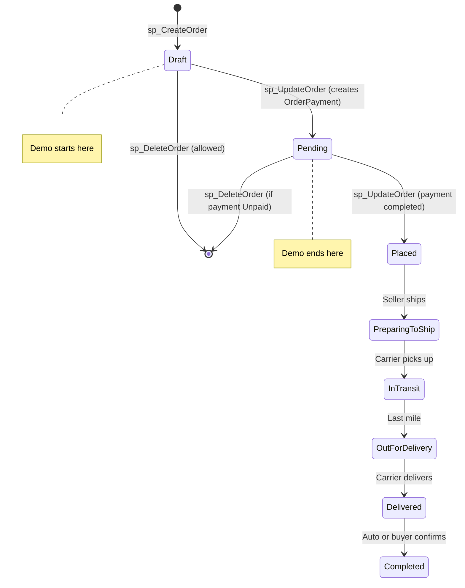
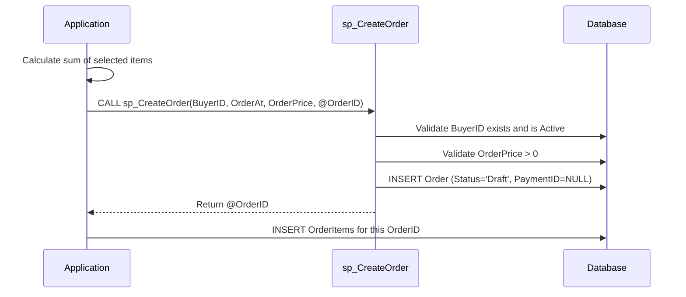
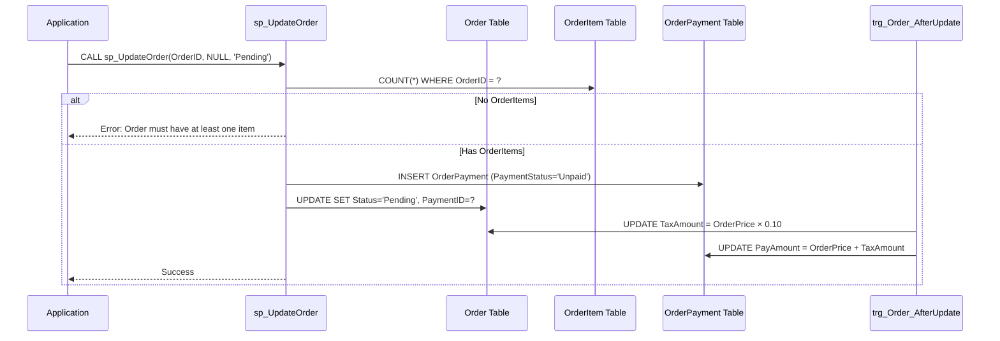
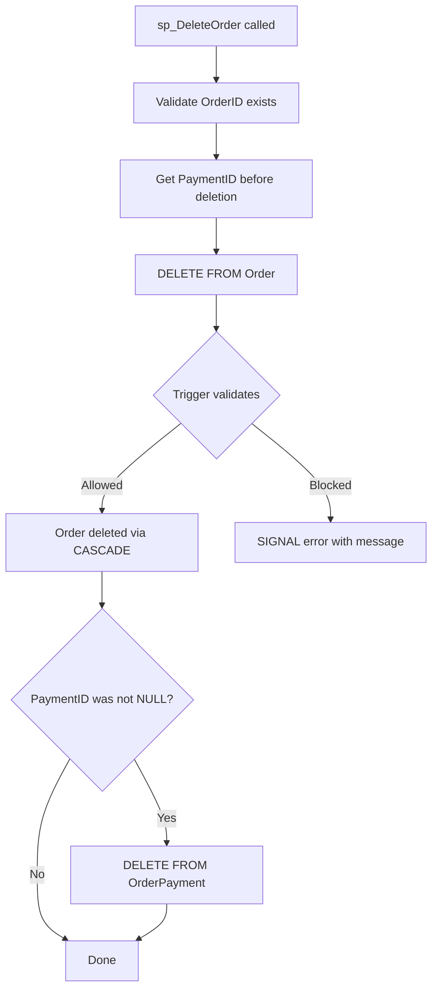
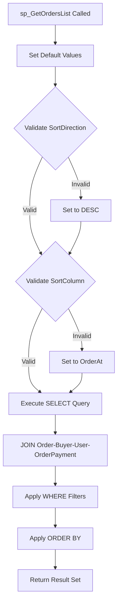
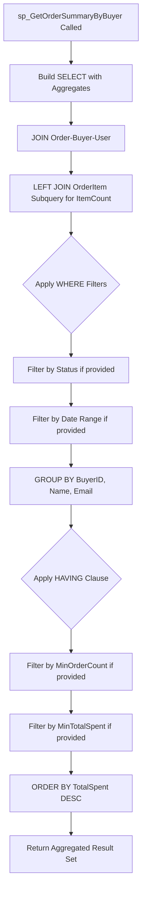
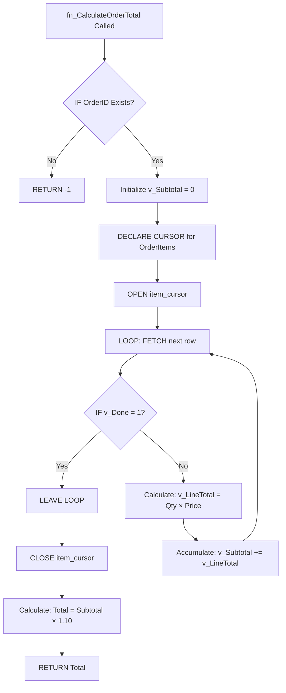
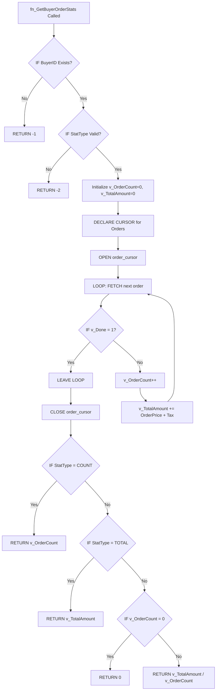

# Assignment 2 - Consolidated Design Document

## E-Commerce Marketplace Database

---

## Table of Contents

1. [Project Overview](#1-project-overview)
2. [Entity Focus: Order](#2-entity-focus-order)
3. [Assignment 2.1: CRUD Procedures](#3-assignment-21-crud-procedures)
4. [Assignment 2.2: Triggers](#4-assignment-22-triggers)
5. [Assignment 2.3: Query Procedures](#5-assignment-23-query-procedures)
6. [Assignment 2.4: Functions](#6-assignment-24-functions)
7. [Assignment 3.1: Input Form Interface](#7-assignment-31-input-form-interface)
8. [Assignment 3.2: List Interface](#8-assignment-32-list-interface)
9. [Assignment 3.3: Additional Interface](#9-assignment-33-additional-interface)
10. [Implementation Status](#10-implementation-status)
11. [Demo Scenario](#11-demo-scenario)

---

## 1. Project Overview

### Course Information
- **Course:** CO2013 - Database Systems
- **Institution:** Ho Chi Minh City University of Technology (HCMUT)
- **Assignment:** Assignment 2
- **Deadline:** Saturday, December 6, 2025


### Key Design Decisions

| Decision | Choice | Rationale |
|----------|--------|-----------|
| **CRUD Entity** | Order | Central to e-commerce, involves multiple related tables |
| **Demo Scope** | Draft → Pending | Shows INSERT, UPDATE, DELETE flow within realistic scope |
| **Promotion Feature** | Dropped | Simplifies flow, not required for core demo |
| **Order Status Start** | Draft | Allows cart summary before commitment |
| **PaymentID Management** | Internal only | Created automatically at Draft→Pending, never user-controllable |
| **OrderPrice** | Set by backend | Calculated as sum of items BEFORE calling sp_CreateOrder |
| **TaxAmount** | Derived attribute | Automatically calculated as OrderPrice × 0.10 by trigger |

---

## 2. Entity Focus: Order

### Order Table Schema

```sql
CREATE TABLE `Order` (
    OrderID INT PRIMARY KEY AUTO_INCREMENT,
    OrderAt DATETIME NOT NULL,
    OrderPrice DECIMAL(10,2) NOT NULL,
    TaxAmount DECIMAL(10,2) NOT NULL DEFAULT 0.00,  -- Derived: OrderPrice × 0.10
    Status VARCHAR(50) NOT NULL,
    PaymentID INT NULL,
    BuyerID INT NOT NULL,
    
    CONSTRAINT CHK_OrderPrice CHECK (OrderPrice >= 0),
    CONSTRAINT CHK_TaxAmount CHECK (TaxAmount >= 0),
    CONSTRAINT FK_Order_OrderPayment FOREIGN KEY (PaymentID)
        REFERENCES OrderPayment(PaymentID),
    CONSTRAINT FK_Order_Buyer FOREIGN KEY (BuyerID)
        REFERENCES Buyer(UserID)
);
```

### Related Tables

```mermaid
erDiagram
    Order ||--o| OrderPayment : "pays via"
    Order ||--|{ OrderItem : "contains"
    Order }o--|| Buyer : "placed by"
    OrderItem }o--|| ProductVariant : "references"
    ProductVariant }o--|| Product : "variant of"
    Product }o--|| Seller : "sold by"
    
    Order {
        int OrderID PK
        datetime OrderAt
        decimal OrderPrice
        decimal TaxAmount "Derived"
        varchar Status
        int PaymentID FK
        int BuyerID FK
    }
    
    OrderPayment {
        int PaymentID PK
        varchar PaymentStatus
        decimal PayAmount
        varchar PaymentMethod
        datetime CreatedAt
        int BuyerID FK
    }
    
    OrderItem {
        int OrderItemID PK
        int OrderID PK_FK
        int OrderItemQuantity
        int VariantID FK
        int ProductID FK
    }
```

### Order Status Flow



**Demo Scope:** `Draft` → `Pending` (with `DELETE` option)

---

## 3. Assignment 2.1: CRUD Procedures

### Status: ✅ Implemented (in [`2.1.sql`](../2.1.sql))

### 3.1 Procedure Summary

| Procedure | Parameters | Description |
|-----------|------------|-------------|
| **sp_CreateOrder** | IN: BuyerID, OrderAt, OrderPrice; OUT: NewOrderID | Creates new Draft order |
| **sp_UpdateOrder** | IN: OrderID, OrderPrice, Status | Updates order, handles Draft→Pending |
| **sp_DeleteOrder** | IN: OrderID | Deletes order (validation via trigger) |

### 3.2 sp_CreateOrder

**Purpose:** Create a new Draft order in the system

**Parameters:**
| Parameter | Type | Description |
|-----------|------|-------------|
| p_BuyerID | INT (IN) | Buyer's UserID |
| p_OrderAt | DATETIME (IN) | Order timestamp (defaults to NOW()) |
| p_OrderPrice | DECIMAL(10,2) (IN) | Total price (backend calculates sum of items) |
| p_NewOrderID | INT (OUT) | Returns the new OrderID |

**Key Design Decisions:**
- ❌ **No p_Status parameter** - New orders are ALWAYS 'Draft'
- ❌ **No PaymentID** - Draft orders never have payment
- ✅ **OrderPrice required** - Backend must calculate sum of items first

**Business Rules:**
1. BuyerID must exist in Buyer table and be 'Active'
2. OrderPrice must be > 0
3. Status is hardcoded as 'Draft'
4. PaymentID is always NULL for new orders

**Flow:**


### 3.3 sp_UpdateOrder

**Purpose:** Update an existing order's status and/or price

**Parameters:**
| Parameter | Type | Description |
|-----------|------|-------------|
| p_OrderID | INT (IN) | Order to update |
| p_OrderPrice | DECIMAL(10,2) (IN) | New price (only changeable in Draft) |
| p_Status | VARCHAR(50) (IN) | New status |

**Key Design Decisions:**
- ❌ **No p_PaymentID parameter** - PaymentID is internally managed
- ✅ **OrderPrice locked after Draft** - Cannot change price after leaving Draft status
- ✅ **OrderItems validation** - Draft→Pending requires at least one OrderItem

**Special Handling: Draft → Pending Transition:**
1. Validates OrderItems exist (at least 1 item required)
2. Auto-creates OrderPayment with Status='Unpaid'
3. Links PaymentID to Order
4. Trigger calculates TaxAmount and updates PayAmount

**Flow:**


### 3.4 sp_DeleteOrder

**Purpose:** Delete an order and its associated payment

**Parameters:**
| Parameter | Type | Description |
|-----------|------|-------------|
| p_OrderID | INT (IN) | Order to delete |

**Business Rules:**
- Validation is delegated to trigger `trg_Order_CheckDeletionAllowed`
- Trigger allows deletion only for: Draft, Cancelled, or Pending with Unpaid payment
- After Order deletion, orphaned OrderPayment is also deleted

**Flow:**


---

## 4. Assignment 2.2: Triggers

### Status: ✅ Implemented (in [`2.2.sql`](../2.2.sql))

### 4.1 Trigger Requirements

From Assignment:
> 2.2.1 Identify one business constraint that requires a trigger to enforce.
> 2.2.2 Choose one derived attribute and write a trigger to calculate its value.

**Key Concepts:**
- **Cross-table semantic constraint**: A business rule that spans multiple tables and cannot be enforced with CHECK constraint
- **Derived attribute**: A column whose value is computed from other columns (possibly in other tables)

### 4.2 Business Constraint Trigger (2.2.1)

**Trigger Name:** `trg_Order_CheckDeletionAllowed`

**Constraint:** Order can only be deleted under specific conditions based on cross-table data

| Check | Condition | Result |
|-------|-----------|--------|
| Order.Status | = 'Draft' | ✅ Allow delete |
| Order.Status | = 'Cancelled' | ✅ Allow delete |
| Order.Status | = 'Pending' AND OrderPayment.PaymentStatus = 'Unpaid' | ✅ Allow delete |
| Any other combination | | ❌ Block delete |

**Why this is a cross-table constraint:**
- Cannot use CHECK constraint because it needs to query `OrderPayment` table
- Must check `OrderPayment.PaymentStatus` to determine if delete is allowed
- This is a semantic constraint spanning Order → OrderPayment

**Business Justification:**
- Orders with processed payments cannot be deleted
- Preserves financial records for accounting and audit
- E-commerce standard: paid orders are immutable records

**Implementation:**
```sql
CREATE TRIGGER trg_Order_CheckDeletionAllowed
BEFORE DELETE ON `Order`
FOR EACH ROW
BEGIN
    DECLARE v_paymentStatus VARCHAR(20);
    
    -- Draft orders: always allowed
    IF OLD.Status = 'Draft' THEN
        SET @dummy = 1;  -- No-op
        
    -- Pending orders: only if payment is 'Unpaid'
    ELSEIF OLD.Status = 'Pending' THEN
        IF OLD.PaymentID IS NOT NULL THEN
            SELECT PaymentStatus INTO v_paymentStatus
            FROM OrderPayment WHERE PaymentID = OLD.PaymentID;
            
            IF v_paymentStatus <> 'Unpaid' THEN
                SIGNAL SQLSTATE '45000'
                    SET MESSAGE_TEXT = 'Cannot delete: Payment is not Unpaid';
            END IF;
        END IF;
        
    -- Cancelled orders: allowed
    ELSEIF OLD.Status = 'Cancelled' THEN
        SET @dummy = 1;
        
    -- All other statuses: blocked with specific messages
    ELSE
        SIGNAL SQLSTATE '45000'
            SET MESSAGE_TEXT = 'Cannot delete: Order has been processed';
    END IF;
END
```

### 4.3 Derived Attribute Trigger (2.2.2)

**Trigger Name:** `trg_Order_AfterUpdate_CalculateTax`

**Derived Attribute:** `Order.TaxAmount`

| Attribute | Formula | When Calculated |
|-----------|---------|-----------------|
| `Order.TaxAmount` | `OrderPrice × 0.10` | Draft → Pending transition |
| `OrderPayment.PayAmount` | `OrderPrice + TaxAmount` | Same trigger updates this |

**Why TaxAmount is a derived attribute:**
- ✅ Value is computed from another column (`OrderPrice`)
- ✅ Automatically maintained by database
- ✅ Not set manually by user

**Why OrderPrice is NOT a derived attribute:**
- ❌ OrderPrice is set by the backend (calculated as sum of items)
- ❌ Stored before Order is created
- ❌ User/app controls this value

**When is TaxAmount calculated?**
- Only when Order status changes from 'Draft' to 'Pending'
- This represents the "checkout" moment when tax is finalized
- TaxAmount = 0 while order is in Draft status

**Implementation:**
```sql
CREATE TRIGGER trg_Order_AfterUpdate_CalculateTax
AFTER UPDATE ON `Order`
FOR EACH ROW
BEGIN
    DECLARE v_TaxAmount DECIMAL(10,2);
    DECLARE v_TaxRate DECIMAL(4,2) DEFAULT 0.10;  -- 10% tax
    
    -- Only on Draft → Pending transition
    IF OLD.Status = 'Draft' AND NEW.Status = 'Pending' THEN
        
        -- Calculate tax (derived attribute)
        SET v_TaxAmount = NEW.OrderPrice * v_TaxRate;
        
        -- Update Order.TaxAmount
        UPDATE `Order`
        SET TaxAmount = v_TaxAmount
        WHERE OrderID = NEW.OrderID;
        
        -- Update OrderPayment.PayAmount to include tax
        IF NEW.PaymentID IS NOT NULL THEN
            UPDATE OrderPayment
            SET PayAmount = NEW.OrderPrice + v_TaxAmount
            WHERE PaymentID = NEW.PaymentID;
        END IF;
    END IF;
END
```

**Schema Requirement:**
```sql
ALTER TABLE `Order`
ADD COLUMN TaxAmount DECIMAL(10,2) NOT NULL DEFAULT 0.00
    COMMENT 'Derived: Tax = OrderPrice × 0.10';
```

---

## 5. Assignment 2.3: Query Procedures

### Status: 📋 Design Ready

### Requirements from Assignment (Lines 59-70):
> - One query that retrieves data from two or more tables and includes WHERE and ORDER BY clauses
> - One query that uses an aggregate function, along with GROUP BY, HAVING, WHERE, and ORDER BY clauses, and joins two or more tables
> - Include at least one stored procedure related to retrieving data from the tables used in query 2.1 (Order table)

---

### 5.1 Procedure 1: sp_GetOrdersList (Multi-table JOIN Query)

#### Purpose
Returns a filterable, sortable list of orders with buyer information for display in the Orders List interface (3.2). This procedure retrieves data from the Order table used in 2.1 CRUD procedures.

#### Requirements Satisfied

| Requirement | Implementation |
|-------------|----------------|
| **JOIN 2+ tables** | `Order` → `Buyer` → `User` (3 tables) |
| **WHERE with input parameters** | Status, BuyerID, DateRange filters using COALESCE |
| **ORDER BY** | Dynamic column sorting with ASC/DESC |
| **Related to 2.1 Order table** | ✅ Primary data source is Order |

#### Parameters

| Parameter | Type | Direction | Description | Default |
|-----------|------|-----------|-------------|---------|
| `p_Status` | VARCHAR(50) | IN | Filter by order status | NULL = all |
| `p_BuyerID` | INT | IN | Filter by specific buyer | NULL = all |
| `p_StartDate` | DATE | IN | Filter orders from date | NULL = no limit |
| `p_EndDate` | DATE | IN | Filter orders to date | NULL = no limit |
| `p_SortColumn` | VARCHAR(20) | IN | Column to sort: OrderID, OrderAt, OrderPrice, Status | 'OrderAt' |
| `p_SortDirection` | VARCHAR(4) | IN | ASC or DESC | 'DESC' |

#### Result Columns

| Column | Type | Source Table | Description |
|--------|------|--------------|-------------|
| `OrderID` | INT | Order | Primary key |
| `OrderAt` | DATETIME | Order | Order timestamp |
| `OrderPrice` | DECIMAL(10,2) | Order | Order subtotal |
| `TaxAmount` | DECIMAL(10,2) | Order | Tax amount |
| `Status` | VARCHAR(50) | Order | Order status |
| `BuyerID` | INT | Order | Buyer foreign key |
| `BuyerName` | VARCHAR(201) | User | CONCAT(FirstName, ' ', LastName) |
| `BuyerEmail` | VARCHAR(100) | User | Buyer's email address |
| `PaymentStatus` | VARCHAR(20) | OrderPayment | Payment state (NULL if no payment) |

#### SQL Implementation

```sql
DELIMITER //

CREATE PROCEDURE sp_GetOrdersList(
    IN p_Status VARCHAR(50),
    IN p_BuyerID INT,
    IN p_StartDate DATE,
    IN p_EndDate DATE,
    IN p_SortColumn VARCHAR(20),
    IN p_SortDirection VARCHAR(4)
)
BEGIN
    -- Set defaults using COALESCE
    SET p_SortColumn = COALESCE(p_SortColumn, 'OrderAt');
    SET p_SortDirection = COALESCE(p_SortDirection, 'DESC');
    
    -- Validate sort direction
    IF p_SortDirection NOT IN ('ASC', 'DESC') THEN
        SET p_SortDirection = 'DESC';
    END IF;
    
    -- Validate sort column (prevent SQL injection)
    IF p_SortColumn NOT IN ('OrderID', 'OrderAt', 'OrderPrice', 'Status', 'BuyerName') THEN
        SET p_SortColumn = 'OrderAt';
    END IF;

    -- Main query with JOINs and dynamic filtering
    SELECT
        o.OrderID,
        o.OrderAt,
        o.OrderPrice,
        o.TaxAmount,
        o.Status,
        o.BuyerID,
        CONCAT(u.FirstName, ' ', u.LastName) AS BuyerName,
        u.Email AS BuyerEmail,
        op.PaymentStatus
    FROM `Order` o
    INNER JOIN Buyer b ON o.BuyerID = b.UserID
    INNER JOIN User u ON b.UserID = u.UserID
    LEFT JOIN OrderPayment op ON o.PaymentID = op.PaymentID
    WHERE
        -- Optional status filter
        (p_Status IS NULL OR o.Status = p_Status)
        -- Optional buyer filter
        AND (p_BuyerID IS NULL OR o.BuyerID = p_BuyerID)
        -- Optional date range filter
        AND (p_StartDate IS NULL OR DATE(o.OrderAt) >= p_StartDate)
        AND (p_EndDate IS NULL OR DATE(o.OrderAt) <= p_EndDate)
    ORDER BY
        CASE WHEN p_SortColumn = 'OrderID' AND p_SortDirection = 'ASC' THEN o.OrderID END ASC,
        CASE WHEN p_SortColumn = 'OrderID' AND p_SortDirection = 'DESC' THEN o.OrderID END DESC,
        CASE WHEN p_SortColumn = 'OrderAt' AND p_SortDirection = 'ASC' THEN o.OrderAt END ASC,
        CASE WHEN p_SortColumn = 'OrderAt' AND p_SortDirection = 'DESC' THEN o.OrderAt END DESC,
        CASE WHEN p_SortColumn = 'OrderPrice' AND p_SortDirection = 'ASC' THEN o.OrderPrice END ASC,
        CASE WHEN p_SortColumn = 'OrderPrice' AND p_SortDirection = 'DESC' THEN o.OrderPrice END DESC,
        CASE WHEN p_SortColumn = 'Status' AND p_SortDirection = 'ASC' THEN o.Status END ASC,
        CASE WHEN p_SortColumn = 'Status' AND p_SortDirection = 'DESC' THEN o.Status END DESC;
END //

DELIMITER ;
```

#### Flow Diagram



#### Test Scenarios for Demo

| Scenario | Call | Expected Result |
|----------|------|-----------------|
| **All orders, newest first** | `CALL sp_GetOrdersList(NULL, NULL, NULL, NULL, NULL, NULL);` | All orders sorted by OrderAt DESC |
| **Filter by Pending status** | `CALL sp_GetOrdersList('Pending', NULL, NULL, NULL, NULL, NULL);` | Only Pending orders |
| **Filter by specific buyer** | `CALL sp_GetOrdersList(NULL, 1, NULL, NULL, NULL, NULL);` | Orders for BuyerID=1 only |
| **Date range filter** | `CALL sp_GetOrdersList(NULL, NULL, '2024-12-01', '2024-12-31', NULL, NULL);` | Orders in December 2024 |
| **Sort by price ascending** | `CALL sp_GetOrdersList(NULL, NULL, NULL, NULL, 'OrderPrice', 'ASC');` | Cheapest orders first |
| **Combined filters** | `CALL sp_GetOrdersList('Draft', 1, '2024-12-01', NULL, 'OrderAt', 'DESC');` | Draft orders for buyer 1 in Dec+ |

---

### 5.2 Procedure 2: sp_GetOrderSummaryByBuyer (Aggregate Query)

#### Purpose
Returns aggregated order statistics grouped by buyer, with filtering capabilities. This demonstrates GROUP BY, HAVING with aggregate functions, and multi-table JOINs. Distinct from `sp_GetOrdersList` which returns individual orders.

#### Requirements Satisfied

| Requirement | Implementation |
|-------------|----------------|
| **JOIN 2+ tables** | `Order` → `Buyer` → `User` → `OrderItem` (4 tables) |
| **Aggregate functions** | COUNT(), SUM(), AVG() |
| **GROUP BY** | By BuyerID, BuyerName |
| **HAVING** | Filter by minimum order count or total spent |
| **WHERE** | Status filter, date range |
| **ORDER BY** | Sort by aggregated values |
| **Related to 2.1 Order table** | ✅ Aggregates from Order |

#### Parameters

| Parameter | Type | Direction | Description | Default |
|-----------|------|-----------|-------------|---------|
| `p_Status` | VARCHAR(50) | IN | Filter orders by status before aggregation | NULL = all |
| `p_StartDate` | DATE | IN | Include orders from this date | NULL = no limit |
| `p_EndDate` | DATE | IN | Include orders until this date | NULL = no limit |
| `p_MinOrderCount` | INT | IN | HAVING: minimum number of orders | NULL = no minimum |
| `p_MinTotalSpent` | DECIMAL(12,2) | IN | HAVING: minimum total amount spent | NULL = no minimum |

#### Result Columns

| Column | Type | Description |
|--------|------|-------------|
| `BuyerID` | INT | Buyer identifier |
| `BuyerName` | VARCHAR(201) | Full name |
| `BuyerEmail` | VARCHAR(100) | Email address |
| `TotalOrders` | INT | COUNT of orders |
| `TotalItemsPurchased` | INT | SUM of order items |
| `TotalSpent` | DECIMAL(12,2) | SUM of OrderPrice |
| `TotalTax` | DECIMAL(12,2) | SUM of TaxAmount |
| `GrandTotal` | DECIMAL(12,2) | TotalSpent + TotalTax |
| `AverageOrderValue` | DECIMAL(10,2) | AVG of OrderPrice |

#### SQL Implementation

```sql
DELIMITER //

CREATE PROCEDURE sp_GetOrderSummaryByBuyer(
    IN p_Status VARCHAR(50),
    IN p_StartDate DATE,
    IN p_EndDate DATE,
    IN p_MinOrderCount INT,
    IN p_MinTotalSpent DECIMAL(12,2)
)
BEGIN
    SELECT
        o.BuyerID,
        CONCAT(u.FirstName, ' ', u.LastName) AS BuyerName,
        u.Email AS BuyerEmail,
        COUNT(DISTINCT o.OrderID) AS TotalOrders,
        COALESCE(SUM(item_counts.ItemCount), 0) AS TotalItemsPurchased,
        SUM(o.OrderPrice) AS TotalSpent,
        SUM(o.TaxAmount) AS TotalTax,
        SUM(o.OrderPrice + o.TaxAmount) AS GrandTotal,
        AVG(o.OrderPrice) AS AverageOrderValue
    FROM `Order` o
    INNER JOIN Buyer b ON o.BuyerID = b.UserID
    INNER JOIN User u ON b.UserID = u.UserID
    LEFT JOIN (
        SELECT OrderID, COUNT(*) AS ItemCount
        FROM OrderItem
        GROUP BY OrderID
    ) item_counts ON o.OrderID = item_counts.OrderID
    WHERE
        -- Optional status filter
        (p_Status IS NULL OR o.Status = p_Status)
        -- Optional date range
        AND (p_StartDate IS NULL OR DATE(o.OrderAt) >= p_StartDate)
        AND (p_EndDate IS NULL OR DATE(o.OrderAt) <= p_EndDate)
    GROUP BY
        o.BuyerID,
        u.FirstName,
        u.LastName,
        u.Email
    HAVING
        -- HAVING with aggregates
        (p_MinOrderCount IS NULL OR COUNT(DISTINCT o.OrderID) >= p_MinOrderCount)
        AND (p_MinTotalSpent IS NULL OR SUM(o.OrderPrice) >= p_MinTotalSpent)
    ORDER BY
        TotalSpent DESC,
        TotalOrders DESC;
END //

DELIMITER ;
```

#### Flow Diagram



#### Test Scenarios for Demo

| Scenario | Call | Expected Result |
|----------|------|-----------------|
| **All buyer summaries** | `CALL sp_GetOrderSummaryByBuyer(NULL, NULL, NULL, NULL, NULL);` | All buyers with order stats |
| **Only completed orders** | `CALL sp_GetOrderSummaryByBuyer('Placed', NULL, NULL, NULL, NULL);` | Stats from Placed orders only |
| **Buyers with 3+ orders** | `CALL sp_GetOrderSummaryByBuyer(NULL, NULL, NULL, 3, NULL);` | Only buyers with 3+ orders |
| **Big spenders: $500+** | `CALL sp_GetOrderSummaryByBuyer(NULL, NULL, NULL, NULL, 500.00);` | Buyers who spent $500+ |
| **December stats, 2+ orders** | `CALL sp_GetOrderSummaryByBuyer(NULL, '2024-12-01', '2024-12-31', 2, NULL);` | Dec buyers with 2+ orders |
| **VIP Pending orders** | `CALL sp_GetOrderSummaryByBuyer('Pending', NULL, NULL, 1, 100.00);` | Pending orders > $100 |

---

## 6. Assignment 2.4: Functions

### Status: 📋 Design Ready

### Requirements from Assignment (Lines 71-76):
> - Contain IF and/or LOOP statements for calculations on stored data
> - Use cursors
> - Include a query to retrieve data for computation
> - Have input parameters and validate them

### Point Deduction Warning (Lines 113-115):
> Functions that have similar or repetitive content will lose points.

---

### 6.1 Function 1: fn_CalculateOrderTotal

#### Purpose
Calculates the total cost of an order by iterating through all OrderItems using a CURSOR, multiplying each item's quantity by its variant price, then adding tax. This demonstrates CURSOR traversal with accumulation logic.

**Distinct from fn_GetBuyerOrderStats:** This function operates on a **single order** and computes **item-level details**, while fn_GetBuyerOrderStats operates across **multiple orders** for statistical analysis.

#### Function Signature

```sql
fn_CalculateOrderTotal(p_OrderID INT) RETURNS DECIMAL(12,2)
```

#### Parameters

| Parameter | Type | Direction | Description | Validation |
|-----------|------|-----------|-------------|------------|
| `p_OrderID` | INT | IN | Order to calculate total for | Must exist in Order table |

#### Return Value

| Type | Description |
|------|-------------|
| DECIMAL(12,2) | Total order cost including tax, or -1 if order not found |

#### Required Elements Checklist

| Requirement | Implementation |
|-------------|----------------|
| **CURSOR** | ✅ Iterates through OrderItems for the order |
| **LOOP** | ✅ WHILE loop processes each item |
| **IF statements** | ✅ Validates OrderID, checks cursor status |
| **Query for computation** | ✅ SELECT from OrderItem JOIN ProductVariant |
| **Input validation** | ✅ Checks if OrderID exists |

#### Pseudocode

```
FUNCTION fn_CalculateOrderTotal(p_OrderID):
    -- STEP 1: Input Validation
    IF OrderID does not exist in Order table THEN
        RETURN -1  -- Error indicator
    END IF
    
    -- STEP 2: Initialize variables
    SET v_Subtotal = 0
    SET v_TaxRate = 0.10
    
    -- STEP 3: Declare CURSOR for order items
    DECLARE item_cursor FOR:
        SELECT oi.OrderItemQuantity, pv.Price
        FROM OrderItem oi
        JOIN ProductVariant pv ON oi.VariantID = pv.VariantID
                               AND oi.ProductID = pv.ProductID
        WHERE oi.OrderID = p_OrderID
    
    -- STEP 4: Open cursor and iterate
    OPEN item_cursor
    
    LOOP:
        FETCH item_cursor INTO v_Quantity, v_Price
        IF no more rows THEN
            EXIT LOOP
        END IF
        
        -- Accumulate line total
        SET v_Subtotal = v_Subtotal + (v_Quantity * v_Price)
    END LOOP
    
    CLOSE item_cursor
    
    -- STEP 5: Calculate final total with tax
    SET v_Total = v_Subtotal + (v_Subtotal * v_TaxRate)
    
    RETURN v_Total
END FUNCTION
```

#### SQL Implementation

```sql
DELIMITER //

CREATE FUNCTION fn_CalculateOrderTotal(p_OrderID INT)
RETURNS DECIMAL(12,2)
DETERMINISTIC
READS SQL DATA
BEGIN
    -- Variables
    DECLARE v_Subtotal DECIMAL(12,2) DEFAULT 0;
    DECLARE v_LineTotal DECIMAL(12,2);
    DECLARE v_Quantity INT;
    DECLARE v_Price DECIMAL(10,2);
    DECLARE v_TaxRate DECIMAL(4,2) DEFAULT 0.10;
    DECLARE v_OrderExists INT DEFAULT 0;
    DECLARE v_Done INT DEFAULT 0;
    
    -- CURSOR declaration: retrieves item quantities and prices
    DECLARE item_cursor CURSOR FOR
        SELECT oi.OrderItemQuantity, pv.Price
        FROM OrderItem oi
        INNER JOIN ProductVariant pv
            ON oi.VariantID = pv.VariantID
            AND oi.ProductID = pv.ProductID
        WHERE oi.OrderID = p_OrderID;
    
    -- Handler for cursor end
    DECLARE CONTINUE HANDLER FOR NOT FOUND SET v_Done = 1;
    
    -- STEP 1: INPUT VALIDATION using IF
    SELECT COUNT(*) INTO v_OrderExists
    FROM `Order`
    WHERE OrderID = p_OrderID;
    
    IF v_OrderExists = 0 THEN
        RETURN -1;  -- Order not found
    END IF;
    
    -- STEP 2: Open cursor and process with LOOP
    OPEN item_cursor;
    
    item_loop: LOOP
        FETCH item_cursor INTO v_Quantity, v_Price;
        
        -- IF to check cursor status
        IF v_Done = 1 THEN
            LEAVE item_loop;
        END IF;
        
        -- Calculate line total and accumulate
        SET v_LineTotal = v_Quantity * v_Price;
        SET v_Subtotal = v_Subtotal + v_LineTotal;
    END LOOP item_loop;
    
    CLOSE item_cursor;
    
    -- STEP 3: Apply tax and return
    RETURN v_Subtotal + (v_Subtotal * v_TaxRate);
END //

DELIMITER ;
```

#### Flow Diagram



#### Test Scenarios for Demo

| Scenario | Call | Expected Result |
|----------|------|-----------------|
| **Valid order with items** | `SELECT fn_CalculateOrderTotal(1);` | Calculated total with 10% tax |
| **Order with no items** | `SELECT fn_CalculateOrderTotal(2);` | 0.00 (no items to sum) |
| **Non-existent order** | `SELECT fn_CalculateOrderTotal(99999);` | -1 (error indicator) |
| **Verify against Order.OrderPrice** | `SELECT fn_CalculateOrderTotal(1), o.OrderPrice * 1.10 FROM Order o WHERE OrderID=1;` | Should match |

---

### 6.2 Function 2: fn_GetBuyerOrderStats

#### Purpose
Retrieves various statistics for a buyer's order history by iterating through their orders using a CURSOR and computing the requested statistic. Supports multiple stat types: order count, total spent, or average order value.

**Distinct from fn_CalculateOrderTotal:** This function operates across **multiple orders** for a buyer and returns **statistical aggregates**, while fn_CalculateOrderTotal computes the **detailed total for a single order**.

#### Function Signature

```sql
fn_GetBuyerOrderStats(p_BuyerID INT, p_StatType VARCHAR(10)) RETURNS DECIMAL(12,2)
```

#### Parameters

| Parameter | Type | Direction | Description | Validation |
|-----------|------|-----------|-------------|------------|
| `p_BuyerID` | INT | IN | Buyer to get statistics for | Must exist in Buyer table |
| `p_StatType` | VARCHAR(10) | IN | Type of statistic: 'COUNT', 'TOTAL', 'AVERAGE' | Must be valid type |

#### Return Value

| Type | Description |
|------|-------------|
| DECIMAL(12,2) | Requested statistic, -1 for invalid buyer, -2 for invalid stat type |

#### Required Elements Checklist

| Requirement | Implementation |
|-------------|----------------|
| **CURSOR** | ✅ Iterates through buyer's orders |
| **LOOP** | ✅ WHILE loop processes each order |
| **IF statements** | ✅ Input validation + stat type selection |
| **Query for computation** | ✅ SELECT from Order table for buyer |
| **Input validation** | ✅ Validates both BuyerID and StatType |

#### Pseudocode

```
FUNCTION fn_GetBuyerOrderStats(p_BuyerID, p_StatType):
    -- STEP 1: Input Validation for BuyerID
    IF BuyerID does not exist in Buyer table THEN
        RETURN -1  -- Invalid buyer
    END IF
    
    -- STEP 2: Input Validation for StatType
    IF p_StatType NOT IN ('COUNT', 'TOTAL', 'AVERAGE') THEN
        RETURN -2  -- Invalid stat type
    END IF
    
    -- STEP 3: Initialize variables
    SET v_OrderCount = 0
    SET v_TotalAmount = 0
    
    -- STEP 4: Declare CURSOR for buyer's orders
    DECLARE order_cursor FOR:
        SELECT OrderPrice, TaxAmount
        FROM Order
        WHERE BuyerID = p_BuyerID
          AND Status NOT IN ('Draft', 'Cancelled')  -- Only completed/processing orders
    
    -- STEP 5: Open cursor and iterate
    OPEN order_cursor
    
    LOOP:
        FETCH order_cursor INTO v_OrderPrice, v_TaxAmount
        IF no more rows THEN
            EXIT LOOP
        END IF
        
        -- Accumulate counts and totals
        SET v_OrderCount = v_OrderCount + 1
        SET v_TotalAmount = v_TotalAmount + v_OrderPrice + v_TaxAmount
    END LOOP
    
    CLOSE order_cursor
    
    -- STEP 6: Calculate and return based on StatType using IF/CASE
    IF p_StatType = 'COUNT' THEN
        RETURN v_OrderCount
    ELSEIF p_StatType = 'TOTAL' THEN
        RETURN v_TotalAmount
    ELSEIF p_StatType = 'AVERAGE' THEN
        IF v_OrderCount = 0 THEN
            RETURN 0  -- Avoid division by zero
        END IF
        RETURN v_TotalAmount / v_OrderCount
    END IF
END FUNCTION
```

#### SQL Implementation

```sql
DELIMITER //

CREATE FUNCTION fn_GetBuyerOrderStats(
    p_BuyerID INT,
    p_StatType VARCHAR(10)
)
RETURNS DECIMAL(12,2)
DETERMINISTIC
READS SQL DATA
BEGIN
    -- Variables
    DECLARE v_OrderCount INT DEFAULT 0;
    DECLARE v_TotalAmount DECIMAL(12,2) DEFAULT 0;
    DECLARE v_OrderPrice DECIMAL(10,2);
    DECLARE v_TaxAmount DECIMAL(10,2);
    DECLARE v_BuyerExists INT DEFAULT 0;
    DECLARE v_Done INT DEFAULT 0;
    
    -- CURSOR declaration: retrieves buyer's order amounts
    DECLARE order_cursor CURSOR FOR
        SELECT OrderPrice, TaxAmount
        FROM `Order`
        WHERE BuyerID = p_BuyerID
          AND Status NOT IN ('Draft', 'Cancelled');
    
    -- Handler for cursor end
    DECLARE CONTINUE HANDLER FOR NOT FOUND SET v_Done = 1;
    
    -- STEP 1: INPUT VALIDATION - Check BuyerID using IF
    SELECT COUNT(*) INTO v_BuyerExists
    FROM Buyer
    WHERE UserID = p_BuyerID;
    
    IF v_BuyerExists = 0 THEN
        RETURN -1;  -- Invalid buyer
    END IF;
    
    -- STEP 2: INPUT VALIDATION - Check StatType using IF
    IF p_StatType NOT IN ('COUNT', 'TOTAL', 'AVERAGE') THEN
        RETURN -2;  -- Invalid stat type
    END IF;
    
    -- STEP 3: Open cursor and process with LOOP
    OPEN order_cursor;
    
    order_loop: LOOP
        FETCH order_cursor INTO v_OrderPrice, v_TaxAmount;
        
        -- IF to check cursor status
        IF v_Done = 1 THEN
            LEAVE order_loop;
        END IF;
        
        -- Accumulate statistics
        SET v_OrderCount = v_OrderCount + 1;
        SET v_TotalAmount = v_TotalAmount + v_OrderPrice + COALESCE(v_TaxAmount, 0);
    END LOOP order_loop;
    
    CLOSE order_cursor;
    
    -- STEP 4: Return requested statistic using IF/ELSEIF
    IF p_StatType = 'COUNT' THEN
        RETURN v_OrderCount;
    ELSEIF p_StatType = 'TOTAL' THEN
        RETURN v_TotalAmount;
    ELSEIF p_StatType = 'AVERAGE' THEN
        -- IF to prevent division by zero
        IF v_OrderCount = 0 THEN
            RETURN 0;
        END IF;
        RETURN v_TotalAmount / v_OrderCount;
    END IF;
    
    RETURN 0;  -- Default fallback
END //

DELIMITER ;
```

#### Flow Diagram



#### Test Scenarios for Demo

| Scenario | Call | Expected Result |
|----------|------|-----------------|
| **Get order count** | `SELECT fn_GetBuyerOrderStats(1, 'COUNT');` | Number of non-draft/cancelled orders |
| **Get total spent** | `SELECT fn_GetBuyerOrderStats(1, 'TOTAL');` | Sum of OrderPrice + Tax |
| **Get average order** | `SELECT fn_GetBuyerOrderStats(1, 'AVERAGE');` | TotalSpent / OrderCount |
| **Invalid buyer** | `SELECT fn_GetBuyerOrderStats(99999, 'COUNT');` | -1 |
| **Invalid stat type** | `SELECT fn_GetBuyerOrderStats(1, 'INVALID');` | -2 |
| **Buyer with no orders** | `SELECT fn_GetBuyerOrderStats(2, 'AVERAGE');` | 0 (no division by zero) |
| **Compare all stats** | `SELECT fn_GetBuyerOrderStats(1, 'COUNT'), fn_GetBuyerOrderStats(1, 'TOTAL'), fn_GetBuyerOrderStats(1, 'AVERAGE');` | Count, Total, Avg for buyer 1 |

---

### 6.3 Functions Summary and Comparison

| Aspect | fn_CalculateOrderTotal | fn_GetBuyerOrderStats |
|--------|------------------------|----------------------|
| **Scope** | Single Order | Multiple Orders (per Buyer) |
| **Input** | OrderID | BuyerID + StatType |
| **CURSOR iterates** | OrderItems in one order | Orders for one buyer |
| **Calculation** | Sum(Qty × Price) + Tax | Count/Sum/Average of Orders |
| **Primary Table** | OrderItem → ProductVariant | Order |
| **Use Case** | Verify order total | Buyer statistics dashboard |
| **Error Codes** | -1 (invalid order) | -1 (invalid buyer), -2 (invalid stat) |

This design ensures no repetitive content while both functions demonstrate CURSOR, LOOP, IF, input validation, and queries for computation as required.

---

## 7. Assignment 3.1: Input Form Interface

### Status: 📋 Design Ready

### 7.1 Interface Layout

```
╔══════════════════════════════════════════════════════════════════════════════╗
║  ORDER MANAGEMENT - CREATE/EDIT ORDER                                         ║
╠══════════════════════════════════════════════════════════════════════════════╣
║                                                                               ║
║  ┌─ STEP 1: Buyer Information ─────────────────────────────────────────────┐ ║
║  │                                                                          │ ║
║  │  Buyer ID:  [________________] [🔍 Validate]                            │ ║
║  │                                                                          │ ║
║  │  Buyer Name: _______________________ (auto-filled after validation)      │ ║
║  │  Email:      _______________________ (auto-filled)                       │ ║
║  │                                                                          │ ║
║  └──────────────────────────────────────────────────────────────────────────┘ ║
║                                                                               ║
║  ┌─ STEP 2: Product Selection ─────────────────────────────────────────────┐ ║
║  │                                                                          │ ║
║  │  Available Products:                     Selected Items:                 │ ║
║  │  ┌───────────────────────────────┐      ┌─────────────────────────────┐ │ ║
║  │  │ ○ iPhone 15 Pro - $999        │      │ Product     Qty   Price     │ │ ║
║  │  │   └ 256GB Black [$999]        │  →   │ ─────────────────────────── │ │ ║
║  │  │   └ 512GB White [$1199]       │  ←   │ iPhone 15    1    $999      │ │ ║
║  │  │ ○ Samsung S24 - $899          │      │ AirPods      2    $398      │ │ ║
║  │  │ ○ AirPods Pro - $199          │      │                             │ │ ║
║  │  └───────────────────────────────┘      └─────────────────────────────┘ │ ║
║  │                                                                          │ ║
║  │  Quantity: [___] [Add to Order →]                                        │ ║
║  │                                                                          │ ║
║  └──────────────────────────────────────────────────────────────────────────┘ ║
║                                                                               ║
║  ┌─ STEP 3: Order Summary ─────────────────────────────────────────────────┐ ║
║  │                                                                          │ ║
║  │  Subtotal:      $1,397.00                                               │ ║
║  │  Tax (10%):     $139.70   (calculated on checkout)                       │ ║
║  │  ─────────────────────────────────────────                               │ ║
║  │  TOTAL:         $1,536.70                                                │ ║
║  │                                                                          │ ║
║  │  Status: Draft (new orders always start as Draft)                        │ ║
║  │                                                                          │ ║
║  └──────────────────────────────────────────────────────────────────────────┘ ║
║                                                                               ║
╠══════════════════════════════════════════════════════════════════════════════╣
║                                                                               ║
║  ┌────────────┐  ┌────────────┐  ┌────────────┐  ┌────────────────────────┐  ║
║  │  💾 INSERT │  │  ✏️ UPDATE  │  │  🗑️ DELETE │  │  ❌ Cancel / Close    │  ║
║  └────────────┘  └────────────┘  └────────────┘  └────────────────────────┘  ║
║                                                                               ║
╚══════════════════════════════════════════════════════════════════════════════╝
```

### 7.2 Button Behavior

| Button | Mode | Action | Calls |
|--------|------|--------|-------|
| **INSERT** | Create | Save new Draft order | sp_CreateOrder(BuyerID, OrderAt, OrderPrice, @OrderID) → INSERT OrderItems |
| **UPDATE** | Edit | Change Draft→Pending | sp_UpdateOrder(OrderID, NULL, 'Pending') |
| **DELETE** | Edit | Remove order | sp_DeleteOrder(OrderID) |
| **Cancel** | Any | Close without saving | - |

---

## 8. Assignment 3.2: List Interface

### Status: 📋 Design Ready

### 8.1 Interface Layout

```
╔══════════════════════════════════════════════════════════════════════════════╗
║  ORDERS LIST                                                                  ║
╠══════════════════════════════════════════════════════════════════════════════╣
║  Filters:                                                                     ║
║  ┌─────────────────┐  ┌──────────────────────┐  ┌─────────────────────────┐  ║
║  │ Status: [All ▼] │  │ Buyer: [__________]  │  │ From: [__/__/____]      │  ║
║  └─────────────────┘  └──────────────────────┘  │ To:   [__/__/____]      │  ║
║                                                  └─────────────────────────┘  ║
║  ┌────────────────────────────────────┐  ┌──────────┐  ┌───────────────┐     ║
║  │ Search: __________________________ │  │ 🔍 Search │  │ Clear Filters │     ║
║  └────────────────────────────────────┘  └──────────┘  └───────────────┘     ║
╠══════════════════════════════════════════════════════════════════════════════╣
║  ┌────────┬────────────────┬────────────┬──────────┬───────────┬───────────┐ ║
║  │OrderID▼│ Buyer Name     │ Date       │ Status   │ Total     │ Tax       │ ║
║  ├────────┼────────────────┼────────────┼──────────┼───────────┼───────────┤ ║
║  │ 1001   │ John Doe       │ 2024-12-01 │ Draft    │ $150.00   │ $0.00     │ ║
║  │ 1002   │ Jane Smith     │ 2024-12-02 │ Pending  │ $75.50    │ $7.55     │ ║
║  │ 1003   │ Bob Wilson     │ 2024-12-02 │ Placed   │ $200.00   │ $20.00    │ ║
║  └────────┴────────────────┴────────────┴──────────┴───────────┴───────────┘ ║
╠══════════════════════════════════════════════════════════════════════════════╣
║  ┌─────────────┐  ┌───────────────┐  ┌────────┐  ┌──────────┐                ║
║  │ + New Order │  │ 👁 View Detail │  │ ✏ Edit │  │ 🗑 Delete │                ║
║  └─────────────┘  └───────────────┘  └────────┘  └──────────┘                ║
╚══════════════════════════════════════════════════════════════════════════════╝
```

### 8.2 Features

| Feature | Implementation | Procedure |
|---------|----------------|-----------|
| Display list | Grid populated on load | sp_GetOrdersList |
| Search | Text input for buyer name | p_SearchTerm parameter |
| Filter | Dropdowns + date pickers | p_Status, p_StartDate, p_EndDate |
| Sort | Clickable column headers | p_SortColumn, p_SortOrder |
| View detail | Row click or button | sp_GetOrderDetail |
| Edit | Opens 3.1 form | sp_UpdateOrder |
| Delete | Confirmation dialog | sp_DeleteOrder |
| New | Opens empty 3.1 form | sp_CreateOrder |

---

## 9. Assignment 3.3: Additional Interface

### Status: 📋 Design Ready

### Option: Order Statistics Dashboard

Uses function fn_GetBuyerOrderStats to display buyer statistics.

```
╔══════════════════════════════════════════════════════════════════════════════╗
║  BUYER ORDER STATISTICS                                                       ║
╠══════════════════════════════════════════════════════════════════════════════╣
║                                                                               ║
║  Select Buyer: [________________▼]                                            ║
║                                                                               ║
║  ┌─────────────────────────────────────────────────────────────────────────┐ ║
║  │                                                                          │ ║
║  │   📦 Total Orders: 15                                                    │ ║
║  │                                                                          │ ║
║  │   💰 Total Spent: $2,450.00                                              │ ║
║  │                                                                          │ ║
║  │   📊 Average Order: $163.33                                              │ ║
║  │                                                                          │ ║
║  └─────────────────────────────────────────────────────────────────────────┘ ║
║                                                                               ║
║  [Calculate Statistics]                                                       ║
║                                                                               ║
╚══════════════════════════════════════════════════════════════════════════════╝
```

---

## 10. Implementation Status

### Summary Table

| Component | Status | File/Location |
|-----------|--------|---------------|
| **1.1 Tables** | ✅ Complete | `CREATE_TABLE.sql` |
| **1.2 Sample Data** | 📋 Pending | `INSERT-data.sql` |
| **2.1 CRUD Procedures** | ✅ Complete | `2.1.sql` |
| **2.2 Triggers** | ✅ Complete | `2.2.sql` |
| **2.3 Query Procedures** | 📋 Design Ready | - |
| **2.4 Functions** | 📋 Design Ready | - |
| **3.1 Input Form** | 📋 Design Ready | - |
| **3.2 List Interface** | 📋 Design Ready | - |
| **3.3 Additional** | 📋 Design Ready | - |

### Checklist

#### Database (Part 2)

- [x] CREATE TABLE statements
- [ ] Add TaxAmount column to Order table
- [ ] Sample data (5+ rows per table)
- [x] sp_CreateOrder - Always creates Draft orders (no Status param)
- [x] sp_UpdateOrder - Internal PaymentID, OrderItems validation, price locking
- [x] sp_DeleteOrder - Delegates to trigger
- [x] trg_Order_CheckDeletionAllowed (2.2.1 - cross-table constraint)
- [x] trg_Order_AfterUpdate_CalculateTax (2.2.2 - derived attribute)
- [ ] sp_GetOrdersList
- [ ] sp_GetOrderDetail
- [ ] fn_CalculateOrderTotal
- [ ] fn_GetBuyerOrderStats

#### Application (Part 3)

- [ ] 3.1 Order Form Interface
- [ ] 3.2 Orders List Interface
- [ ] 3.3 Statistics Interface
- [ ] Database connectivity

---

## 11. Demo Scenario

### Demo Flow Script

```
1. SHOW DATABASE STRUCTURE
   - Open CREATE_TABLE.sql
   - Explain Order table with TaxAmount column (derived attribute)
   - Show related tables (OrderPayment, OrderItem)
   - Show sample data

2. DEMONSTRATE 3.2 LIST INTERFACE
   - Open Orders List screen
   - Show existing orders (if any)
   - Demonstrate Search by buyer name
   - Demonstrate Filter by status
   - Demonstrate Sort by column

3. DEMONSTRATE 3.1 INSERT (CREATE ORDER)
   - Click "New Order"
   - Enter valid BuyerID
   - Select products and quantities
   - App calculates OrderPrice (sum of items)
   - Show Summary (Subtotal, Tax preview = 0 until checkout)
   - Click INSERT
   - [sp_CreateOrder: Creates Order with Status='Draft', TaxAmount=0]
   - [Creates OrderItems]
   - Show new order in list (Tax = $0.00)

4. DEMONSTRATE 3.1 UPDATE (DRAFT → PENDING)
   - Select the Draft order
   - Click UPDATE (Checkout)
   - [sp_UpdateOrder checks OrderItems exist]
   - [sp_UpdateOrder: Creates OrderPayment, changes Status='Pending']
   - [TRIGGER trg_Order_AfterUpdate_CalculateTax fires:
     - Calculates TaxAmount = OrderPrice × 0.10
     - Updates Order.TaxAmount
     - Updates OrderPayment.PayAmount = OrderPrice + TaxAmount]
   - Show updated list with tax calculated

5. DEMONSTRATE 3.1 DELETE
   - Try to DELETE a Pending order (simulate payment processing)
   - Mark payment as 'Processing'
   - [TRIGGER trg_Order_CheckDeletionAllowed blocks it]
   - Show error message: "Payment is not Unpaid"
   - Select a Draft order
   - Click DELETE
   - [Trigger allows deletion]
   - Confirm deletion
   - Show order removed from list

6. DEMONSTRATE 2.3 QUERY PROCEDURES
   - Run sp_GetOrdersList with filters
   - Run sp_GetOrderDetail for specific order

7. DEMONSTRATE 2.4 FUNCTIONS
   - Run fn_CalculateOrderTotal
   - Run fn_GetBuyerOrderStats

8. SHOW 3.3 STATISTICS INTERFACE
   - Select a buyer
   - Display calculated statistics
```

---

## Related Documents

| Document | Description |
|----------|-------------|
| [`CREATE_TABLE.sql`](../CREATE_TABLE.sql) | Table creation scripts |
| [`2.1.sql`](../2.1.sql) | CRUD procedures |
| [`2.2.sql`](../2.2.sql) | Triggers |
| [`Assignment2_Instruction.pdf`](Assignment2_Instruction.pdf) | Original assignment requirements |

---

## Version History

| Version | Date | Changes |
|---------|------|---------|
| 1.0 | 2024-12-05 | Initial consolidated document |
| 1.1 | 2024-12-05 | Updated 2.2 triggers design |
| 2.0 | 2024-12-05 | Major refactoring based on discussion: |
|     |            | - sp_CreateOrder: Removed p_Status parameter (always Draft) |
|     |            | - sp_UpdateOrder: Removed p_PaymentID (internally managed) |
|     |            | - sp_UpdateOrder: Added OrderItems validation for Draft→Pending |
|     |            | - sp_UpdateOrder: OrderPrice locked after leaving Draft |
|     |            | - Clarified: OrderPrice is NOT derived, TaxAmount IS |
|     |            | - Updated all diagrams and flows |
|     |            | - Marked 2.1 and 2.2 as Complete |

---

*This document consolidates all design decisions and serves as the primary reference for implementing Assignment 2.*
