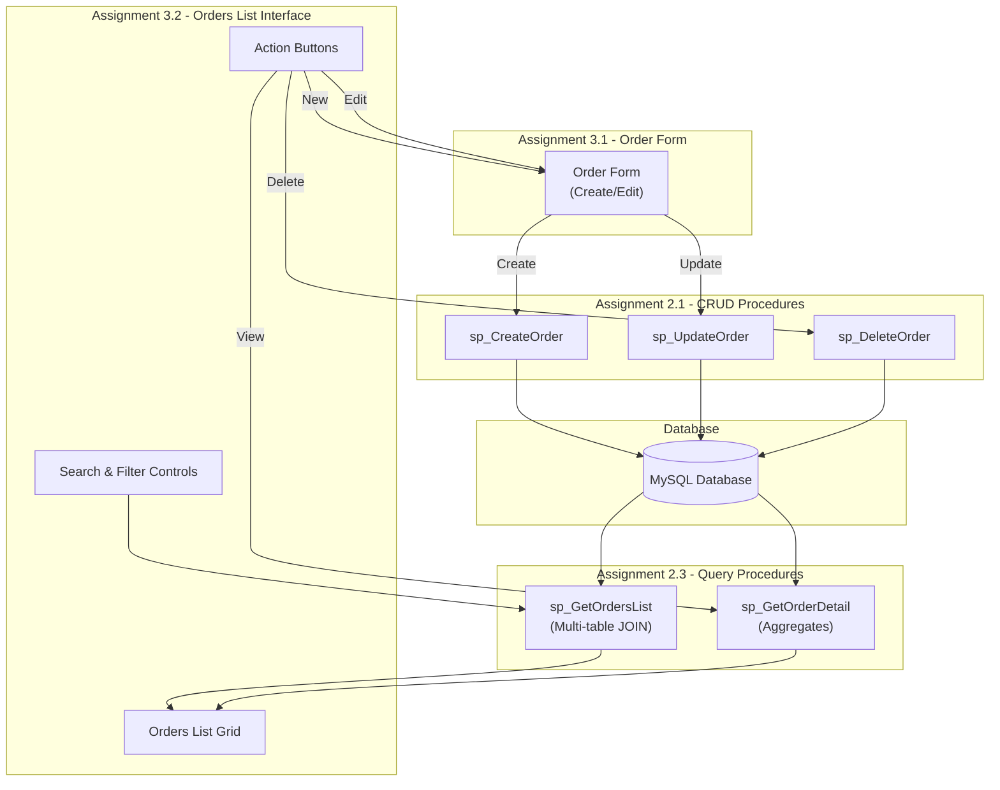
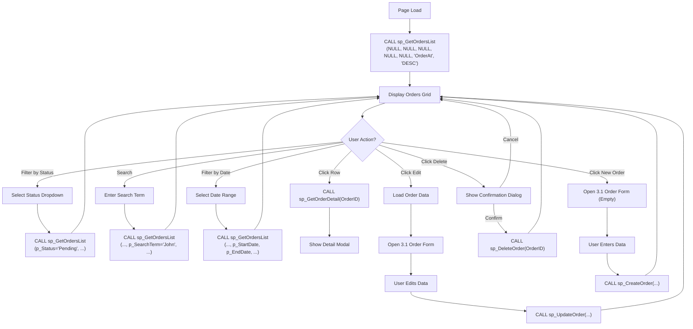
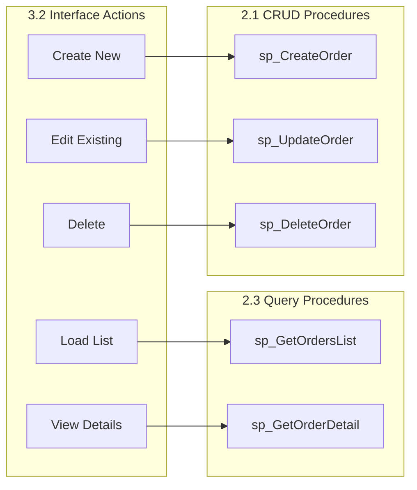

# Query Procedures and Interface Design Document

## Assignment 2.3 (Query Stored Procedures) & Assignment 3.2 (List Interface)

---

## 1. Overview

This document consolidates the design specifications for two related assignments:

| Assignment | Description | Purpose |
|------------|-------------|---------|
| **2.3** | Query Stored Procedures | Create procedures for displaying and filtering data |
| **3.2** | List Interface Design | Application interface that consumes the query procedures |

Both assignments focus on the **Order** table established in Assignment 2.1, creating a complete data flow from storage to presentation.

---

## 2. Connection Chain

### Relationship Flow

The assignments form a connected workflow where user actions in the interface trigger stored procedures:

```
2.1 (Order CRUD) ← User Action ← 3.2 (Interface) ← 2.3 (Query Procedures)
```

**Explanation:**
- **2.3 Query Procedures** provide data retrieval capabilities (read-only)
- **3.2 Interface** displays data and captures user intent
- **User Actions** translate interface events to procedure calls
- **2.1 CRUD Procedures** execute data modifications

### System Architecture Diagram



---

## 3. Assignment 2.3 Procedures

### 3.1 Procedure 1: sp_GetOrdersList (Simple Multi-table Query)

#### Purpose
Returns a filterable, sortable list of orders for display in the 3.2 grid interface. This procedure supports dynamic filtering and pagination for efficient data retrieval.

#### Requirements Met

| Requirement | Implementation |
|-------------|----------------|
| **JOIN 2+ tables** | `Order` → `Buyer` → `User` (for buyer name), `OrderItem` (for item count) |
| **WHERE with input parameters** | Status, BuyerID, DateRange, SearchTerm |
| **ORDER BY with parameter** | Configurable sort column and direction |

#### Parameters

| Parameter | Type | Description | Default Behavior |
|-----------|------|-------------|------------------|
| `p_Status` | VARCHAR(50) | Filter by order status | NULL = all statuses |
| `p_BuyerID` | INT | Filter by specific buyer | NULL = all buyers |
| `p_StartDate` | DATE | Filter orders from date | NULL = no start limit |
| `p_EndDate` | DATE | Filter orders to date | NULL = no end limit |
| `p_SearchTerm` | VARCHAR(100) | Search in buyer name | NULL = no search filter |
| `p_SortColumn` | VARCHAR(50) | Column to sort by | Default: 'OrderAt' |
| `p_SortOrder` | VARCHAR(4) | ASC or DESC | Default: 'DESC' |

#### Return Columns

| Column | Type | Source | Description |
|--------|------|--------|-------------|
| `OrderID` | INT | `Order` | Primary key |
| `BuyerID` | INT | `Order` | Foreign key to Buyer |
| `BuyerName` | VARCHAR | `User` (via Buyer) | Buyer's display name |
| `OrderAt` | DATETIME | `Order` | Order creation timestamp |
| `Status` | VARCHAR | `Order` | Current order status |
| `OrderPrice` | DECIMAL | `Order` | Total order amount |
| `ItemCount` | INT | Calculated | COUNT of OrderItems |
| `PaymentStatus` | VARCHAR | `Order` | Payment state |

#### Procedure Implementation

```sql
DELIMITER //

CREATE PROCEDURE sp_GetOrdersList(
    IN p_Status VARCHAR(50),
    IN p_BuyerID INT,
    IN p_StartDate DATE,
    IN p_EndDate DATE,
    IN p_SearchTerm VARCHAR(100),
    IN p_SortColumn VARCHAR(50),
    IN p_SortOrder VARCHAR(4)
)
BEGIN
    -- Set default values
    SET p_SortColumn = IFNULL(p_SortColumn, 'OrderAt');
    SET p_SortOrder = IFNULL(p_SortOrder, 'DESC');
    
    -- Validate sort order
    IF p_SortOrder NOT IN ('ASC', 'DESC') THEN
        SET p_SortOrder = 'DESC';
    END IF;
    
    -- Build and execute dynamic query
    SET @sql = CONCAT('
        SELECT 
            o.OrderID,
            o.BuyerID,
            u.Name AS BuyerName,
            o.OrderAt,
            o.Status,
            o.OrderPrice,
            COUNT(oi.OrderItemID) AS ItemCount,
            o.PaymentStatus
        FROM `Order` o
        INNER JOIN Buyer b ON o.BuyerID = b.BuyerID
        INNER JOIN `User` u ON b.UserID = u.UserID
        LEFT JOIN OrderItem oi ON o.OrderID = oi.OrderID
        WHERE 1=1'
    );
    
    -- Add dynamic filters
    IF p_Status IS NOT NULL THEN
        SET @sql = CONCAT(@sql, ' AND o.Status = ''', p_Status, '''');
    END IF;
    
    IF p_BuyerID IS NOT NULL THEN
        SET @sql = CONCAT(@sql, ' AND o.BuyerID = ', p_BuyerID);
    END IF;
    
    IF p_StartDate IS NOT NULL THEN
        SET @sql = CONCAT(@sql, ' AND DATE(o.OrderAt) >= ''', p_StartDate, '''');
    END IF;
    
    IF p_EndDate IS NOT NULL THEN
        SET @sql = CONCAT(@sql, ' AND DATE(o.OrderAt) <= ''', p_EndDate, '''');
    END IF;
    
    IF p_SearchTerm IS NOT NULL AND p_SearchTerm != '' THEN
        SET @sql = CONCAT(@sql, ' AND u.Name LIKE ''%', p_SearchTerm, '%''');
    END IF;
    
    -- Add GROUP BY
    SET @sql = CONCAT(@sql, ' GROUP BY o.OrderID, o.BuyerID, u.Name, o.OrderAt, o.Status, o.OrderPrice, o.PaymentStatus');
    
    -- Add ORDER BY
    SET @sql = CONCAT(@sql, ' ORDER BY ', p_SortColumn, ' ', p_SortOrder);
    
    -- Execute
    PREPARE stmt FROM @sql;
    EXECUTE stmt;
    DEALLOCATE PREPARE stmt;
END //

DELIMITER ;
```

---

### 3.2 Procedure 2: sp_GetOrderDetail (Aggregate Query)

#### Purpose
Returns comprehensive details for a single order, including aggregated item information and related entity data. Used when user clicks on an order row for detailed view.

#### Requirements Met

| Requirement | Implementation |
|-------------|----------------|
| **JOIN 2+ tables** | `Order` → `OrderItem` → `ProductVariant` → `Product` → `Seller` |
| **Aggregate functions** | COUNT(), SUM() for order totals |
| **GROUP BY** | Order header fields |
| **HAVING** | Optional filter by minimum item count or total value |
| **WHERE** | OrderID parameter |
| **ORDER BY** | Item details sorting |

#### Parameters

| Parameter | Type | Description |
|-----------|------|-------------|
| `p_OrderID` | INT | The order ID to retrieve details for |

#### Return Structure

**Result Set 1: Order Header**

| Column | Type | Description |
|--------|------|-------------|
| `OrderID` | INT | Order identifier |
| `BuyerID` | INT | Buyer foreign key |
| `BuyerName` | VARCHAR | Buyer's name |
| `BuyerEmail` | VARCHAR | Buyer's email |
| `BuyerPhone` | VARCHAR | Buyer's phone |
| `OrderAt` | DATETIME | Order timestamp |
| `Status` | VARCHAR | Order status |
| `PaymentStatus` | VARCHAR | Payment state |
| `PaymentMethod` | VARCHAR | Payment type |
| `ShippingAddress` | TEXT | Delivery address |
| `OrderPrice` | DECIMAL | Order total |
| `TotalItems` | INT | COUNT of items |
| `TotalQuantity` | INT | SUM of quantities |

**Result Set 2: Order Items**

| Column | Type | Description |
|--------|------|-------------|
| `OrderItemID` | INT | Item line identifier |
| `ProductID` | INT | Product foreign key |
| `ProductName` | VARCHAR | Product name |
| `VariantName` | VARCHAR | Variant description |
| `SellerName` | VARCHAR | Seller's name |
| `Quantity` | INT | Ordered quantity |
| `UnitPrice` | DECIMAL | Price per unit |
| `LineTotal` | DECIMAL | Quantity × UnitPrice |

#### Procedure Implementation

```sql
DELIMITER //

CREATE PROCEDURE sp_GetOrderDetail(
    IN p_OrderID INT
)
BEGIN
    -- Validate OrderID exists
    DECLARE v_OrderExists INT DEFAULT 0;
    
    SELECT COUNT(*) INTO v_OrderExists 
    FROM `Order` 
    WHERE OrderID = p_OrderID;
    
    IF v_OrderExists = 0 THEN
        SIGNAL SQLSTATE '45000'
            SET MESSAGE_TEXT = 'Order not found';
    END IF;
    
    -- Result Set 1: Order Header with Aggregates
    SELECT 
        o.OrderID,
        o.BuyerID,
        u.Name AS BuyerName,
        u.Email AS BuyerEmail,
        u.Phone AS BuyerPhone,
        o.OrderAt,
        o.Status,
        o.PaymentStatus,
        o.PaymentMethod,
        o.ShippingAddress,
        o.OrderPrice,
        COUNT(oi.OrderItemID) AS TotalItems,
        SUM(oi.Quantity) AS TotalQuantity
    FROM `Order` o
    INNER JOIN Buyer b ON o.BuyerID = b.BuyerID
    INNER JOIN `User` u ON b.UserID = u.UserID
    LEFT JOIN OrderItem oi ON o.OrderID = oi.OrderID
    WHERE o.OrderID = p_OrderID
    GROUP BY 
        o.OrderID, o.BuyerID, u.Name, u.Email, u.Phone,
        o.OrderAt, o.Status, o.PaymentStatus, o.PaymentMethod,
        o.ShippingAddress, o.OrderPrice
    HAVING COUNT(oi.OrderItemID) >= 0;  -- Always true, demonstrates HAVING
    
    -- Result Set 2: Order Items with Product Details
    SELECT 
        oi.OrderItemID,
        p.ProductID,
        p.ProductName,
        pv.VariantName,
        su.Name AS SellerName,
        oi.Quantity,
        oi.Price AS UnitPrice,
        (oi.Quantity * oi.Price) AS LineTotal
    FROM OrderItem oi
    INNER JOIN ProductVariant pv ON oi.VariantID = pv.VariantID
    INNER JOIN Product p ON pv.ProductID = p.ProductID
    INNER JOIN Seller s ON p.SellerID = s.SellerID
    INNER JOIN `User` su ON s.UserID = su.UserID
    WHERE oi.OrderID = p_OrderID
    ORDER BY oi.OrderItemID ASC;
END //

DELIMITER ;
```

---

## 4. Assignment 3.2 Interface Design

### 4.1 Interface Layout

#### Orders Management Screen

```
╔══════════════════════════════════════════════════════════════════════════════╗
║  ORDERS MANAGEMENT                                                            ║
╠══════════════════════════════════════════════════════════════════════════════╣
║  Filters:                                                                     ║
║  ┌─────────────────┐  ┌──────────────────────┐  ┌─────────────────────────┐  ║
║  │ Status: [All ▼] │  │ Buyer: [__________]  │  │ From: [__/__/____]      │  ║
║  └─────────────────┘  └──────────────────────┘  │ To:   [__/__/____]      │  ║
║                                                  └─────────────────────────┘  ║
║  ┌────────────────────────────────────┐  ┌──────────┐  ┌───────────────┐     ║
║  │ Search: __________________________ │  │ 🔍 Search │  │ Clear Filters │     ║
║  └────────────────────────────────────┘  └──────────┘  └───────────────┘     ║
╠══════════════════════════════════════════════════════════════════════════════╣
║  ┌────────┬────────────────┬────────────┬──────────┬───────────┬───────────┐ ║
║  │OrderID▼│ Buyer Name     │ Date       │ Status   │ Total     │ Items     │ ║
║  ├────────┼────────────────┼────────────┼──────────┼───────────┼───────────┤ ║
║  │ 1001   │ John Doe       │ 2024-12-01 │ Placed   │ $150.00   │ 3         │ ║
║  │ 1002   │ Jane Smith     │ 2024-12-02 │ Pending  │ $75.50    │ 1         │ ║
║  │ 1003   │ Bob Wilson     │ 2024-12-02 │ Draft    │ $200.00   │ 5         │ ║
║  │ 1004   │ Alice Brown    │ 2024-12-03 │ Shipped  │ $320.75   │ 4         │ ║
║  │ 1005   │ Charlie Davis  │ 2024-12-03 │ Complete │ $89.99    │ 2         │ ║
║  └────────┴────────────────┴────────────┴──────────┴───────────┴───────────┘ ║
║                                                                               ║
║  Showing 1-5 of 25 orders                          [< Prev] [1] [2] [3] [>]  ║
╠══════════════════════════════════════════════════════════════════════════════╣
║  ┌─────────────┐  ┌───────────────┐  ┌────────┐  ┌──────────┐                ║
║  │ + New Order │  │ 👁 View Detail │  │ ✏ Edit │  │ 🗑 Delete │                ║
║  └─────────────┘  └───────────────┘  └────────┘  └──────────┘                ║
╚══════════════════════════════════════════════════════════════════════════════╝
```

#### Order Detail Modal (triggered by sp_GetOrderDetail)

```
╔══════════════════════════════════════════════════════════════════╗
║  ORDER DETAILS - #1001                                    [✕]    ║
╠══════════════════════════════════════════════════════════════════╣
║  Order Information                                               ║
║  ├─ Order ID:     1001                                           ║
║  ├─ Status:       Placed                                         ║
║  ├─ Order Date:   2024-12-01 14:30:00                           ║
║  ├─ Payment:      Credit Card (Paid)                            ║
║  └─ Total:        $150.00                                        ║
║                                                                  ║
║  Buyer Information                                               ║
║  ├─ Name:         John Doe                                       ║
║  ├─ Email:        john.doe@email.com                            ║
║  ├─ Phone:        +1-555-0123                                   ║
║  └─ Address:      123 Main St, City, Country                    ║
╠══════════════════════════════════════════════════════════════════╣
║  Order Items (3 items, 5 total quantity)                         ║
║  ┌─────────────────────────┬──────────┬────────┬────────┬──────┐ ║
║  │ Product                 │ Variant  │ Seller │ Qty    │ Price│ ║
║  ├─────────────────────────┼──────────┼────────┼────────┼──────┤ ║
║  │ Wireless Mouse          │ Black    │ TechCo │ 2      │$30.00│ ║
║  │ USB-C Cable             │ 2m       │ CableCo│ 2      │$15.00│ ║
║  │ Mouse Pad               │ Large    │ TechCo │ 1      │$45.00│ ║
║  └─────────────────────────┴──────────┴────────┴────────┴──────┘ ║
║                                              Subtotal: $150.00   ║
╠══════════════════════════════════════════════════════════════════╣
║  ┌────────────┐  ┌────────────┐  ┌───────────────┐               ║
║  │ ✏ Edit     │  │ 🗑 Delete  │  │ Close         │               ║
║  └────────────┘  └────────────┘  └───────────────┘               ║
╚══════════════════════════════════════════════════════════════════╝
```

---

### 4.2 Features Required (from Assignment)

| Feature | Implementation | Procedure Used |
|---------|----------------|----------------|
| **Display data list** | Grid populated on page load | `sp_GetOrdersList` |
| **Search** | Text input searches buyer names | `p_SearchTerm` parameter |
| **Filter** | Dropdown and date pickers | `p_Status`, `p_BuyerID`, `p_StartDate`, `p_EndDate` |
| **Sorting** | Clickable column headers | `p_SortColumn`, `p_SortOrder` parameters |
| **Input validation** | Client + server-side validation | Application layer before calling |
| **Update data** | Select row → Edit button | `sp_UpdateOrder` (from 2.1) |
| **Delete data** | Select row → Delete button | `sp_DeleteOrder` (from 2.1) |
| **Error handling** | Try-catch blocks, user messages | Catch SQL errors from procedures |

---

### 4.3 User Workflow



#### Workflow Steps Description

| Step | User Action | System Response | Procedure Called |
|------|-------------|-----------------|------------------|
| 1 | Page loads | Fetch all orders (default view) | `sp_GetOrdersList(NULL, NULL, NULL, NULL, NULL, 'OrderAt', 'DESC')` |
| 2 | Selects status filter | Re-fetch with status filter | `sp_GetOrdersList('Pending', NULL, NULL, NULL, NULL, 'OrderAt', 'DESC')` |
| 3 | Enters search term | Re-fetch with search filter | `sp_GetOrdersList(NULL, NULL, NULL, NULL, 'John', 'BuyerName', 'ASC')` |
| 4 | Clicks order row | Fetch order details | `sp_GetOrderDetail(1001)` |
| 5 | Clicks Edit button | Opens form with order data | Form populated from detail result |
| 6 | Clicks Delete button | Confirmation → Execute delete | `sp_DeleteOrder(1001)` |
| 7 | Clicks New Order | Opens empty form | `sp_CreateOrder(...)` on submit |

---

## 5. How It Connects to 2.1 (CRUD Procedures)

### Procedure Mapping



### Complete Action-to-Procedure Matrix

| Interface Action | Procedure | Assignment | Purpose |
|-----------------|-----------|------------|---------|
| Load list | `sp_GetOrdersList` | 2.3 | Display orders in grid |
| Apply filters | `sp_GetOrdersList` | 2.3 | Filter/search orders |
| View details | `sp_GetOrderDetail` | 2.3 | Show order detail modal |
| Create new | `sp_CreateOrder` | 2.1 | Insert new order |
| Edit existing | `sp_UpdateOrder` | 2.1 | Modify existing order |
| Delete | `sp_DeleteOrder` | 2.1 | Remove order |

---

## 6. Sample Calls for Demo

### Basic Operations

```sql
-- ===========================================
-- SAMPLE CALLS FOR DEMONSTRATION
-- ===========================================

-- 1. Load all orders (default view - newest first)
CALL sp_GetOrdersList(NULL, NULL, NULL, NULL, NULL, 'OrderAt', 'DESC');

-- 2. Filter by status (show only Pending orders)
CALL sp_GetOrdersList('Pending', NULL, NULL, NULL, NULL, 'OrderAt', 'DESC');

-- 3. Filter by specific buyer
CALL sp_GetOrdersList(NULL, 101, NULL, NULL, NULL, 'OrderAt', 'DESC');

-- 4. Filter by date range (December 2024)
CALL sp_GetOrdersList(NULL, NULL, '2024-12-01', '2024-12-31', NULL, 'OrderAt', 'DESC');

-- 5. Search buyer name containing "John"
CALL sp_GetOrdersList(NULL, NULL, NULL, NULL, 'John', 'BuyerName', 'ASC');

-- 6. Combined filters: Pending orders in December, sorted by price
CALL sp_GetOrdersList('Pending', NULL, '2024-12-01', '2024-12-31', NULL, 'OrderPrice', 'DESC');

-- 7. Get specific order details
CALL sp_GetOrderDetail(1001);

-- 8. Get another order details
CALL sp_GetOrderDetail(1002);
```

### Error Handling Examples

```sql
-- Attempt to get non-existent order (should raise error)
CALL sp_GetOrderDetail(99999);
-- Expected: Error "Order not found"

-- Invalid sort order (should default to DESC)
CALL sp_GetOrdersList(NULL, NULL, NULL, NULL, NULL, 'OrderAt', 'INVALID');
-- Expected: Falls back to DESC
```

---

## 7. Implementation Checklist

### Backend (Database) Tasks

- [ ] **Implement sp_GetOrdersList**
  - [ ] Create procedure with all parameters
  - [ ] Implement dynamic WHERE clause
  - [ ] Add ORDER BY with validation
  - [ ] Test with various filter combinations

- [ ] **Implement sp_GetOrderDetail**
  - [ ] Create procedure with error handling
  - [ ] Return two result sets (header + items)
  - [ ] Include all JOIN tables
  - [ ] Test with sample order data

### Frontend (Interface) Tasks

- [ ] **Create 3.2 interface with grid component**
  - [ ] Design responsive grid layout
  - [ ] Implement column sorting (clickable headers)
  - [ ] Add pagination controls

- [ ] **Implement filter controls**
  - [ ] Status dropdown
  - [ ] Buyer input/dropdown
  - [ ] Date range pickers
  - [ ] Clear filters button

- [ ] **Implement search functionality**
  - [ ] Search input with debounce
  - [ ] Real-time or button-triggered search

- [ ] **Connect CRUD buttons to 2.1 procedures**
  - [ ] New Order → sp_CreateOrder
  - [ ] Edit → sp_UpdateOrder
  - [ ] Delete → sp_DeleteOrder

- [ ] **Add error handling**
  - [ ] Display SQL error messages
  - [ ] Validation feedback
  - [ ] Confirmation dialogs

### Testing Tasks

- [ ] **Test with sample data**
  - [ ] Verify all filters work correctly
  - [ ] Test edge cases (no results, large datasets)
  - [ ] Validate error handling

---

## 8. Related Documents

| Document | Description | Location |
|----------|-------------|----------|
| ERD Diagram | Entity Relationship Diagram | `docs/ERD.png` |
| Purchase Flow Design | Order purchase workflow | `docs/Purchase_Flow_Design.md` |
| Assignment Instructions | Original requirements | `docs/Assignment2_Instruction.pdf` |

---

## 9. Version History

| Version | Date | Author | Changes |
|---------|------|--------|---------|
| 1.0 | 2024-12-04 | - | Initial document creation |